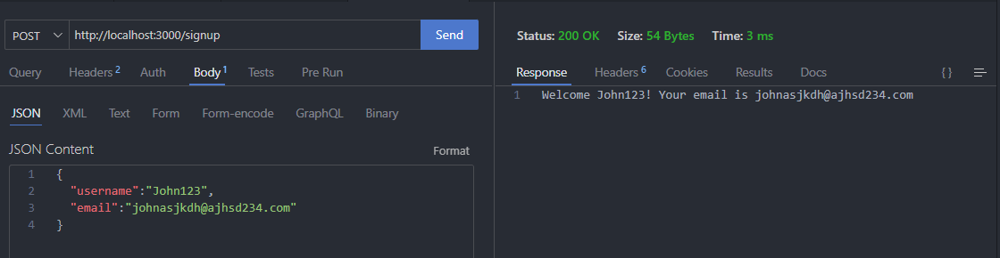
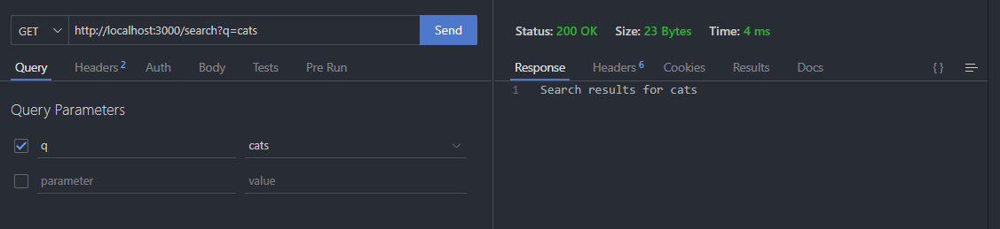
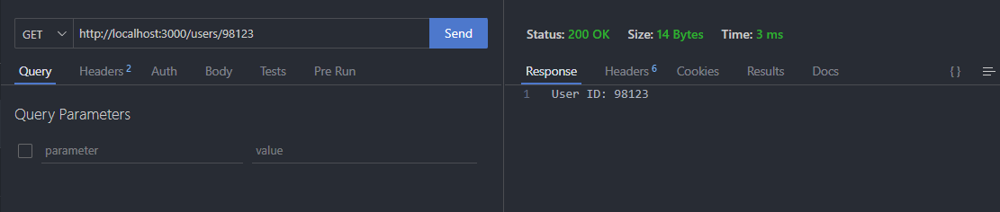
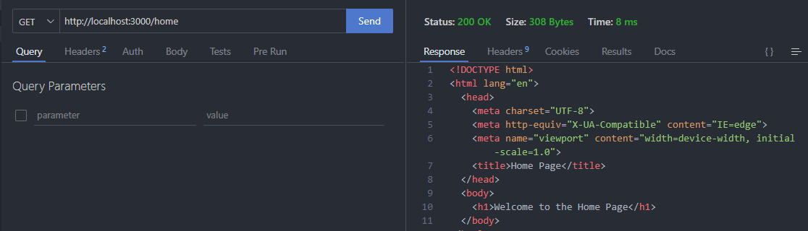
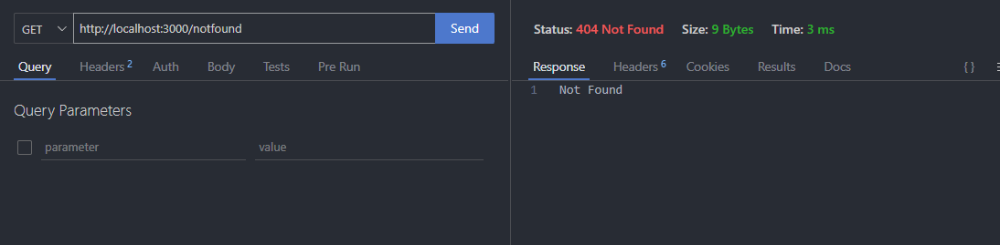
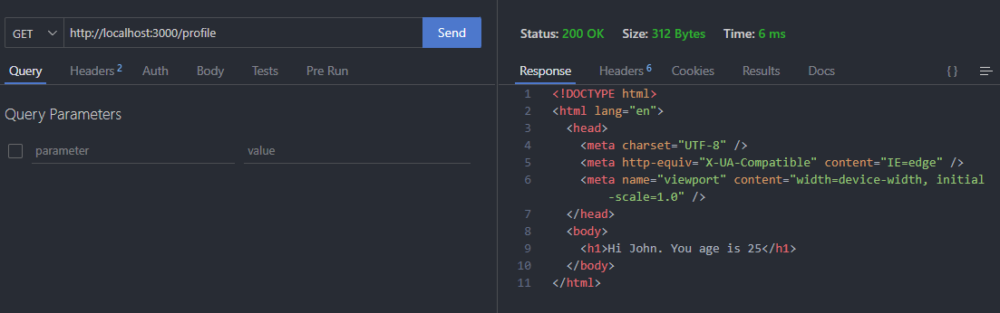
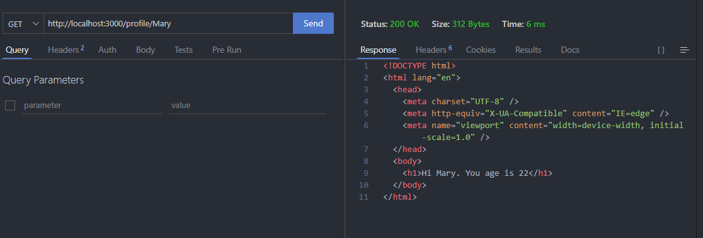
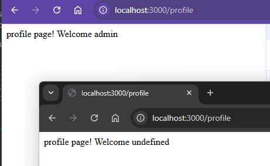
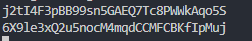

# Express.js Tutorial

Express.js is a Node.js framework that we will use to build the server app. It is defined as

> Fast, unopinionated, minimalist web framework for Node.js

## Table of Contents

- [Installation](#installation)
- [Hello World Example](#hello-world-example)
- [Routing](#routing)
- [Handling Request Data - `req.body`](#handling-request-data----reqbody-)
- [Handling Request Data - `req.query`](#handling-request-data----reqquery-)
- [Handling Request Data - `req.params`](#handling-request-data----reqparams-)
- [Express.js Response Methods](#expressjs-response-methods)
- [Detour: Find, Filter, Map, and Reduce Functions](#detour--find--filter--map--and-reduce-functions)
- [Express.js Middleware](#expressjs-middleware)
- [Express.js Sessions](#expressjs-sessions)

## Installation

To install Express.js, you need to have Node.js installed on your machine. If you don't have Node.js installed, you can download it from [here](https://nodejs.org/en/download/).
Next, you can install Express.js by running the following command in your terminal:

```bash
npm install express
```

Check the installation steps in Express.js [documentation](https://expressjs.com/en/starter/installing.html).
Also, you need to initialize the project by running the following command:

```bash
npm init
```

This command will create a `package.json` file in your project directory.

## Hello World Example

To create a simple Express.js server, you can create a file named `server.js` and add the following code:

```javascript
const express = require("express");
const app = express();

app.get("/", (req, res) => {
  res.send("Hello World!");
});

app.listen(3000, () => {
  console.log("Server is running on http://localhost:3000");
});
```

To run the server, you can execute the following command in your terminal:

```bash
node server.js
```

Now, you can open your browser and navigate to `http://localhost:3000` to see the `Hello World!` message.

<details>
<summary>Nodemon vs. Node Commands</summary>
Nodemon is a tool that helps develop Node.js applications by automatically restarting the node application when file changes in the directory are detected. To install Nodemon, you can run the following command:
```bash
npm install -g nodemon
```
To run the server using Nodemon, you can execute the following command in your terminal:
```bash
nodemon server.js
```
</details>

<details>
<summary>3000 Port Number</summary>
The port number `3000` is used in the example to run the server on the local machine. You can change the port number to any other number if you want to run the server on a different port. The valid port numbers are between `0` and `65535`. Think about port numbers as apartment numbers in a building. Each apartment has a unique number, and the same applies to port numbers. Computers on the internet are identified by their IP addresses, and the port number is used to identify the specific service running on the computer.
</details>

Alright, you have successfully created a simple Express.js server. In the next section, we will learn about routing in Express.js.

## Routing

Routing is a mechanism to handle different HTTP requests in the server. In Express.js, you can define routes to handle different requests. For example, you can define a route to handle `GET` requests to the `/about` path. Here is an example:

```javascript
app.get("/about", (req, res) => {
  res.send("About Page");
});
```

In this example, we defined a route for the `GET` request to the `/about` path. When the user navigates to `http://localhost:3000/about`, the server will respond with the `About Page` message.

You can define routes for different HTTP methods such as `GET`, `POST`, `PUT`, `DELETE`, etc. For example, you can define a route for the `POST` request to the `/signup` path:

```javascript
app.post("/signup", (req, res) => {
  res.send("Sign up page");
});
```

In `POST` requests, you can access the data sent by the client in the request body. We will learn more about handling form data in the next section.

## Handling Request Data - `req.body`

In Express.js, you can handle request data sent by the client in different ways. For example, you can access the query parameters sent in the URL, request body, URL parameters.

Let us continue with the previous example and define a route to handle the `POST` request to the `/signup` path with a request body:

```javascript
app.use(express.json());
app.post("/signup", (req, res) => {
  const { username, email } = req.body;
  res.send(`Welcome ${username}! Your email is ${email}`);
});
```

The `express.json()` middleware is used to parse the request body as JSON. In this example, we are expecting the client to send a JSON object with `username` and `email` fields. We can access the data sent by the client in the `req.body` object. We will learn more about middleware in the next section.
To test the `POST` request, you can use tools like Thunder Client or POSTMAN. Here is an example using Thunder Client:


Notice that the client is sending a JSON object with `username` and `email` fields. The server will respond with a message that includes the `username` and `email` sent by the client.

<details>
<summary>Express.urlencoded vs. Express.json Middleware</summary>
The `express.urlencoded()` middleware is used to parse the request body as URL-encoded data. The `express.json()` middleware is used to parse the request body as JSON. You can use `express.urlencoded()` middleware to parse form data sent by the client. 
To use the `express.urlencoded()` middleware, you can add the following line of code:
```javascript
app.use(express.urlencoded({ extended: true }));
```
</details>

<details>
<summary>JS Destructuring</summary>
In the example, we are using JavaScript destructuring to extract the `username` and `email` fields from the `req.body` object. Destructuring is a convenient way to extract multiple properties from an object and assign them to variables. You can learn more about destructuring [here](https://developer.mozilla.org/en-US/docs/Web/JavaScript/Reference/Operators/Destructuring_assignment).

Alternatively, you can access the `username` and `email` fields using the following code:

```javascript
const username = req.body.username;
const email = req.body.email;
```

</details>

## Handling Request Data - `req.query`

In Express.js, you can access the query parameters sent in the URL using the `req.query` object. For example, you can define a route to handle the `GET` request to the `/search` path with query parameters:

```javascript
app.get("/search", (req, res) => {
  const q = req.query.q;
  res.send(`Search results for ${q}`);
});
```



In this example, we are expecting the client to send a query parameter `q` in the URL. We can access the query parameter using `req.query.q`. For example, when the user navigates to `http://localhost:3000/search?q=cats`, the server will respond with `Search results for cats`.

Query parameters are used for filtering, sorting, and searching data. By passing multiple query parameters, you can customize the response based on the client's request.

## Handling Request Data - `req.params`

URL parameters are used to pass data in the URL path. In Express.js, you can define routes with URL parameters using `:` followed by the parameter name. For example, you can define a route to handle the `GET` request to the `/users/:id` path:

```javascript
app.get("/users/:id", (req, res) => {
  const id = req.params.id;
  res.send(`User ID: ${id}`);
});
```

In this example, we are defining a route with a URL parameter `id`. We can access the URL parameter using `req.params.id`. For example, when the user navigates to `http://localhost:3000/users/98123`, the server will respond with `User ID: 98123`.



URL parameters are used to identify a specific resource in the server. For example, you can use URL parameters to get information about a specific user, product, or category. By using URL parameters, you can create dynamic routes that respond to different requests based on the parameter values.

## Express.js Response Methods

Express.js provides several methods to send a response to the client. `res.send` is the most common method used to send a response. You can also use other methods such as `res.json` to send JSON data, `res.sendFile` to send a file, `res.download` to download a file, and `res.redirect` to redirect the client to a different URL.

Make sure that you always send a response to the client in the route handler. If you don't send a response, the client will keep waiting for the response and eventually timeout. Also, you can only send one response to the client in a route handler. If you send multiple responses, you will get an error.

- `res.sendFile`:
  Here is an example of using `res.sendFile` to send a file to the client:

  ```javascript
  app.get("/home", (req, res) => {
    res.sendFile(__dirname + "/home.html");
  });
  ```

  Assuming `home.html` is in the same directory as the `server.js` file, the server will send the `home.html` file to the client when the user navigates to `http://localhost:3000/home`.

  Here is a sample `home.html` file:

  ```html
  <!DOCTYPE html>
  <html lang="en">
    <head>
      <meta charset="UTF-8" />
      <meta http-equiv="X-UA-Compatible" content="IE=edge" />
      <meta name="viewport" content="width=device-width, initial-scale=1.0" />
      <title>Home Page</title>
    </head>
    <body>
      <h1>Welcome to the Home Page</h1>
    </body>
  </html>
  ```

  

- `res.status`:
  You can set the status code of the response using the `res.status` method. For example, you can set the status code to `404` for a `Not Found` response:

  ```javascript
  app.get("/notfound", (req, res) => {
    res.status(404).send("Not Found");
  });
  ```

  

  This route is helpful when a client requests a resource that does not exist on the server. By setting the status code to `404`, you are informing the client that the resource is not found.

  We can expand the previous example by adding a last resort route that will handle all requests that do not match any of the defined routes. This route is defined using the `*` wildcard character:

  ```javascript
  app.get("*", (req, res) => {
    res.status(404).send("Page Not Found");
  });
  ```

  ⚠️ Make sure you add this route at the end of all other routes. This route will handle all requests that do not match any of the defined routes. If you put this route at the beginning, it will match all requests, and other routes will not be executed!

  <details>
  <summary>HTTP Status Codes</summary>
  HTTP status codes are standardized codes that the server sends to the client to inform about the status of the request. The status codes are divided into different categories such as `1xx` for informational responses, `2xx` for successful responses, `3xx` for redirection responses, `4xx` for client errors, and `5xx` for server errors. You can learn more about HTTP status codes [here](https://developer.mozilla.org/en-US/docs/Web/HTTP/Status).
  </details>

- `res.redirect`
  Suppose you have a protected resource like a `profile` page that only authenticated users can access. If a user authenticates successfully, you can redirect the user to the `profile` page using the `res.redirect` method:

  ```javascript
  app.get("/profile", (req, res) => {
    res.send("Profile Page");
  });

  app.get("/login", (req, res) => {
    // Authenticate the user
    authenticated = true;
    if (authenticated) {
      res.redirect("/profile");
    } else res.send("Check your credentials");
  });
  ```

- `res.render`
  The `res.render` method is used to render a view template using a template engine like EJS orPug. We can start by creating a template engine using EJS. First, you need to install the EJS package:

  ```bash
  npm install ejs
  ```

  Next, you can set the view engine to EJS in your `server.js` file:

  ```javascript
  app.set("view engine", "ejs");
  ```

  Create a `views` directory in your project directory and add an `index.ejs` file:

  ```html
  <!DOCTYPE html>
  <html lang="en">
    <head>
      <meta charset="UTF-8" />
      <meta http-equiv="X-UA-Compatible" content="IE=edge" />
      <meta name="viewport" content="width=device-width, initial-scale=1.0" />
    </head>
    <body>
      <h1>Hi <%= name %>. You age is <%= age %></h1>
    </body>
  </html>
  ```

  Finally, you can render the `index.ejs` file using the `res.render` method:

  ```javascript
  app.get("/profile", (req, res) => {
    res.render("index", { name: "John", age: 30 });
  });
  ```

  

  In this example, we are rendering the `index.ejs` file with the data `{ name: "John", age: 30 }`. The template engine will replace the `<%= name %>` and `<%= age %>` placeholders with the actual data.

  View templates are used to generate dynamic HTML content based on the data passed to the template. Hence, view templates are reusable! For example, suppose there are three users with different names and ages. You can render the `index.ejs` file with different data for each user:

  ```javascript
  app.get("/profile/:name", (req, res) => {
    console.log(req.params.name);
    listOfUser = [
      { name: "John", age: "21" },
      { name: "Mary", age: "22" },
      { name: "Tom", age: "23" },
    ];

    x = listOfUser.find((aUser) => aUser.name == req.params.name);

    res.render("userProfile", x);
  });
  ```

  

  In this example, we are rendering the `userProfile.ejs` file with the data of the user whose name matches the URL parameter. You can expand the size of the `listOfUser` array to include more users and yet the code will still work with a single view template!

  <details>
  <summary>JS `find` function</summary>
  The `find` function is used to find the first element in an array that satisfies a condition. The `find` function takes a callback function as an argument that returns `true` if the element satisfies the condition. You can learn more about the `find` function [here](https://developer.mozilla.org/en-US/docs/Web/JavaScript/Reference/Global_Objects/Array/find).
  </details>

## Detour: Find, Filter, Map, and Reduce Functions

As you have seen already, the `find` function is used to find the first element in an array that satisfies a condition. There are other functions like `filter`, `map`, and `reduce` that are used to manipulate arrays in JavaScript.

- `Filter` Function:
  The `filter` function is used to create a new array with elements that satisfy a condition. For example, you can filter out the `kiwi` fruits from the `fruits` array:

  ```javascript
  fruits = [
    { name: "apple", color: "red" },
    { name: "banana", color: "yellow" },
    { name: "kiwi", color: "green" },
    { name: "kiwi", color: "yellow" },
  ];
  x = fruits.filter((element) => {
    return element.name == "kiwi";
  });
  console.log(x); // [{ name: "kiwi", color: "green" }, { name: "kiwi", color: "yellow" }]
  ```

  In this example, we are filtering out the `kiwi` fruits from the `fruits` array. The `filter` function returns a new array with elements that satisfy the condition. The `find` function is similar to the `filter` function, but it returns the first element that satisfies the condition. Again the `find` function does not return an array but a single element ⚠️.

- `Map` Function:
  The `map` function is used to create a new array by applying a function to each element in the array. For example, you can create a new array with the names of the fruits:

  ```javascript
  fruits = [
    { name: "apple", color: "red" },
    { name: "banana", color: "yellow" },
    { name: "kiwi", color: "green" },
    { name: "kiwi", color: "yellow" },
  ];
  x = fruits.map((element) => {
    return element.name;
  });
  console.log(x); // ["apple", "banana", "kiwi", "kiwi"]
  ```

  In this example, we are creating a new array with the names of the fruits. The `map` function applies the function to each element in the array and returns a new array with the results.

- `Reduce` Function:
  The `reduce` function is used to reduce an array to a single value. For example, you can calculate the total price of the fruits:

  ```javascript
  fruits = [
    { name: "apple", price: 1 },
    { name: "banana", price: 2 },
    { name: "kiwi", price: 3 },
    { name: "kiwi", price: 4 },
  ];
  x = fruits.reduce((total, element) => {
    return total + element.price;
  }, 0);
  console.log(x); // 10
  ```

  In this example, we are calculating the total price of the fruits. The `reduce` function takes an accumulator and the current element as arguments and returns a single value.

# Express.js Middleware

Have you wondered how Express.js works under the hood? Express.js uses middleware to handle requests and responses. Middleware functions are functions that have access to the request object (`req`), the response object (`res`), and the next middleware function in the application's request-response cycle.

Suppose there are two routes `profile` and `adminDashboard`. We want to authenticate the user before accessing the `profile` route and authorize the user before accessing the `adminDashboard` route. Also, we want to log the time of each request to the server. We can use a middleware functions to:

- Log the time of each request
- Authenticate before accessing the both routs
- Authorize the user before accessing the `adminDashboard` route

Here is an example of using middleware functions in Express.js:

```js
const e = require("express");
const express = require("express");
const app = express();

// as a global middleware
// time logger
app.use((req, res, next) => {
  console.log("time info " + Date.now());
  next();
});

// authentication middleware
app.use((req, res, next) => {
  x = true;
  if (x) {
    console.log("authenticated!");
    next();
    return;
  } else res.send("check your username and password!");
});

app.get("/profile", (req, res) => {
  res.send("all good");
});

// admin authorizer middleware
app.use((req, res, next) => {
  isAdmin = true;
  if (isAdmin) {
    console.log("authorized!");
    next();
    return;
  }
  res.send("check your role!");
});

app.get("/adminDashboard", (req, res) => {
  res.send("all good");
});

app.listen(3000, () => {
  console.log("all good. listening to 3000!");
});
```

- Notice that the middleware functions are defined using the `app.use` method. `app.use` is used to mount the middleware function meaning that the middleware function will be executed for every next request. We use `app.get` to define global middleware functions.

- The middleware function takes three arguments: `req`, `res`, and `next`. The `next` function is used to pass control to the next middleware function in the request-response cycle. If you don't call the `next` function, the request-response cycle will be terminated, and the client will keep waiting for the response.

- You may also chain multiple middleware functions in the same route. For example, you can chain the authentication and authorization middleware functions in the `adminDashboard` route:

  ```js
  app.get(
    "/adminDashboard",
    (req, res, next) => {
      console.log("adminDashboard route");
      next();
    },
    (req, res) => {
      res.send("adminDashboard route");
    }
  );
  ```

- The order of middleware functions is important in Express.js. Middleware functions are executed in the order they are defined. For example, if you define the authentication middleware after the route handler, the authentication middleware will not be executed. Make sure you define the middleware functions before the route handlers.

<details>
<summary>Authentication vs Authorization</summary>
Authentication is the process of verifying the identity of a user. For example, when a user logs in to a website, the server verifies the username and password to authenticate the user. Authorization is the process of determining what a user can access. For example, an admin user has access to the admin dashboard, while a regular user does not have access to the admin dashboard.
</details>

<details>
<summary>`if else` vs. `if {return}}` </summary>
In the example, we are first used `if else` statements to check if the user is authenticated and authorized. If the user is authenticated, we call the `next` function to pass control to the next middleware function. If the user is not authenticated, we send a response to the client. You can also use `if {return}}` statements to check if the user is authenticated and authorized. The `return` statement is used to exit the function and prevent the execution of the next middleware function.
</details>

# Express.js Sessions

Sessions are used to store user data during the user's session. In Express.js, you can use the `express-session` middleware to create sessions. The `express-session` middleware sores tthe session data on the server and sends a session ID to the client. The client sends the session ID in subsequent requests, and the server uses the session ID to retrieve the session data. Cookies are used to store the session ID on the client side. Here is an example of using sessions in Express.js:

```js
const e = require("express");
const express = require("express");
const app = express();
var session = require("express-session");

app.use(
  session({
    secret: "keyboard cat",
    resave: false,
    saveUninitialized: true,
    cookie: { secure: false },
  })
);

app.get("/login", (req, res) => {
  res.sendFile(__dirname + "/login.html");
});

app.use(express.urlencoded({ extended: true }));

app.post("/login", (req, res) => {
  console.log(req.body);
  console.log(req.body.username);
  req.session.x = req.body.username;
  console.log("All good. Signed in!");
  res.redirect("/profile");
});

app.get("/profile", (req, res) => {
  console.log(req.session.id);
  res.send(`profile page! Welcome ${req.session.x}`);
});

app.listen(3000, () => {
  console.log("all good. listening to 3000!");
});
```

and here is `login.html` file:

```html
<!DOCTYPE html>
<html lang="en">
  <head>
    <meta charset="UTF-8" />
    <meta name="viewport" content="width=device-width, initial-scale=1.0" />
    <title>Document</title>
  </head>
  <body>
    <form action="login" method="post">
      <label for="username">Username</label>
      <input type="text" id="username" name="username" />
      <label for="password">Password</label>
      <input type="password" id="password" name="password" />
      <button type="submit">Login</button>
    </form>
  </body>
</html>
```

In this example, we are using the `express-session` middleware to create sessions. The `express-session` middleware takes an object with configuration options. The `secret` option is used to sign the session ID cookie. The `resave` option is used to save the session data even if the session was not modified. The `saveUninitialized` option is used to save the session data even if the session is new. The `cookie` option is used to configure the session cookie. The `secure` option is used to set the cookie secure attribute. The `secure` attribute is used to ensure that the cookie is sent only over HTTPS.

And don't forget to install the `express-session` package:

```bash
npm install express-session
```

Now if the admin tried to login, the server will store the username in the session and redirect the admin to the profile page. The profile page will display the username stored in the session. The session data is stored on the server, and the session ID is sent to the client in a cookie. The client sends the session ID in subsequent requests, and the server uses the session ID to retrieve the session data. Sessions are used to store user data during the user's session. You can store user data such as the username, email, role, and preferences in the session. Sessions are useful for creating personalized user experiences and maintaining user data during the user's session. Sessions data are not shared between different users. Each user has a unique session ID and session data.  


Notice in the above images, that a a non-admin tried to access the profile page after the admin had already logged in in another session window. The server will not display the username of the admin in the profile page of the non-admin. This is because the session data is stored on the server and is not shared between different users. Each user has a unique session ID and session data.

Here is `console.log` output of these two sessions:  


You can also verify these ids on the client side by opening the browsers developer tools and checking the cookies section. You will see that each session has a unique session ID and the IDs are matching the IDs printed in the console. Also, You can check the network tab to verify that cookies are sent in the request headers for each request from the client to the server.

<details>
<summary>`express.urlencoded` Middleware</summary>
The `express.urlencoded` middleware is used to parse the request body as URL-encoded data. The `express.json` middleware is used to parse the request body as JSON. You can use the `express.urlencoded` middleware to parse form data sent by the client. To use the `express.urlencoded` middleware, you can add the following line of code:
```javascript
app.use(express.urlencoded({ extended: true }));
```
</details>

Phew! This is it for now. Next week we will build apps using Express.js 🚀!
